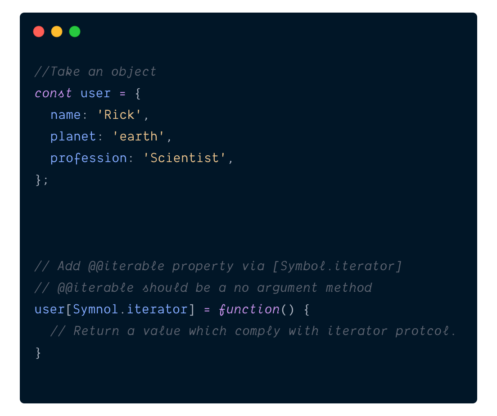
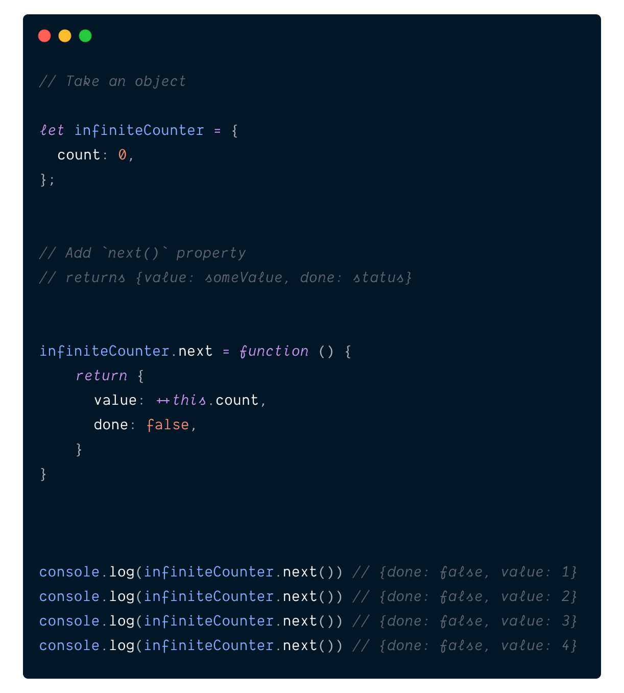
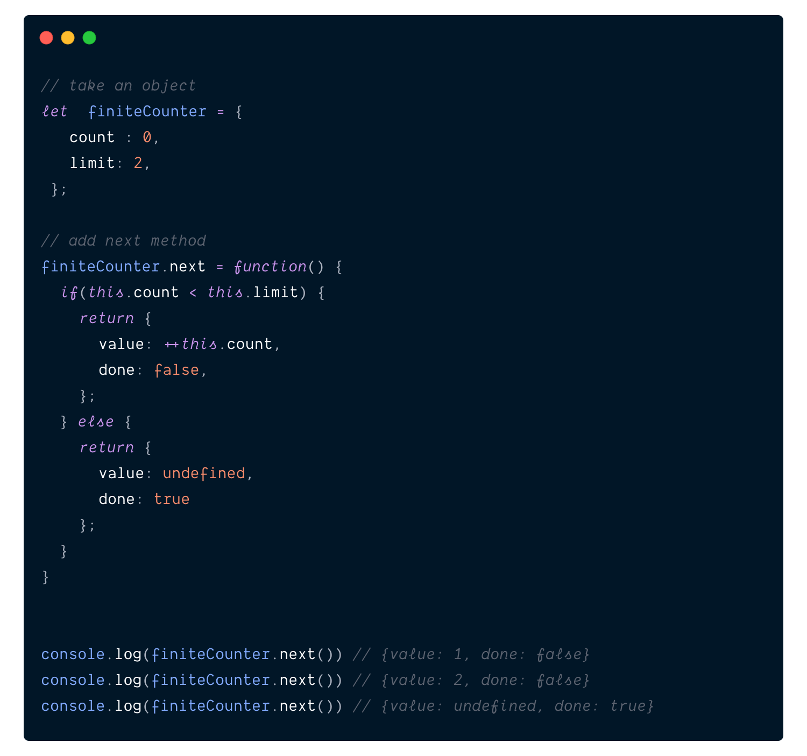
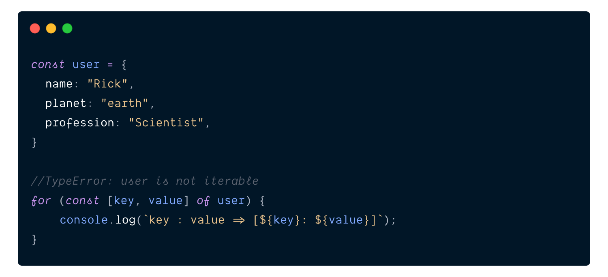
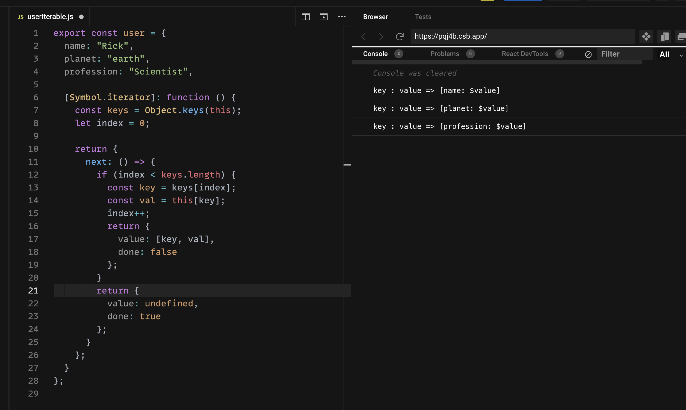

When **ES6** launched, it introduced two important protocols `Iterable` and `Iterator`. Basically we can convert any type of `object` to `iterable` by implementing these two `protocols`. By converting the `object` to `iterable` we can perform looping with `for...of` loop. We can also use `spread operator` in array (which is `...` symbol in JS) on these objects.

First let's understand these two protocols:
##Iterable Protocol:

As per MDN

> The `iterable protocol` allows JavaScript objects to `define` or `customize` their `iteration behavior`, such as what values are looped over in a `for...of` construct.

In simple terms it is a rule and by following this rule we can do two things:

- If an object is already iterable, we can modify it's existing `iteration behaviour`
- If an object is not iterable, we can add `iteration` behaviour to it.

If you have used JavaScript as a beginner then you have already used one of the famous iterable `Array`s. Obviously there are other built in `iterables` in JavaScript as well. Some of the examples are :

- Map
- Set
- WeakMap
- WeakSet

Now the main question comes into picture.

**How do we implement this protocol ?**

This is very simple. We just need to implement `@@iterator`. This `@@iterator` is special property in JS. So to make any object `iterable` we need to add this `@@iterable` property to it.

We can get this by using constant symbol `[Symbol.iterator]`. If you do not known what Symbols are, please read [here](https://developer.mozilla.org/en-US/docs/Web/JavaScript/Reference/Global_Objects/Symbol).

`@@iterator` should be a simple method with `no arguments` which will return a value that should comply with `iterator protocol`.

To summarise, we can convert any object to `Iterable` by using following steps:

- Take an object
- Add `@@iterable` property via `[Symbol.iterator]`
- `@@iterable` should be a `no argument` method
- Return of `@@iterable` method should be an `iterator`.



Before we explore deep into Iterable Jungle. Let's talk about `iterator protocol`

##Iterator protocol:

As per MDN

> The `iterator protocol` defines a standard way to produce a sequence of values (either finite or infinite), and potentially a return value when all values have been generated.

In plain English:

- It is a rule which defines `shape` of values during iteration.
- It also needs to tell us that there are `no more values` when we have gone through all the values.

To make any object `iterator` we need to implement `next()` method which will return an object which should have these two properties to it:

- **value** - value which will be available during iteration
- **done** - boolean value to indicate that there are more values or not

That's quite simple. Isn't it ? here is an example of `Infinite Counter` iterator



You can create a `finite counter` iterator as well



Notice how when limit is reached we return `done: true`. This is to tell the iterator like `for...of` loop that there is no more values and you can stop the loop.

Now that we know how to implement `iterator`, let's head back to our `iterable` and implement it fully.

So for our example we want `user` to be `iterable` and return us `[key, value]` when we iterate through `for...of` loop. If you try to iterate `user` in `for...of` without implementing `iterable` you will get following error:

> TypeError: user is not iterable



So here is a [codesandbox](https://codesandbox.io/s/iterable-pqj4b?file=/src/userIterable.js) implementation of making `user` iterable:



As you can see, we have added `[Symbol.iterator]` which intern return an object containing our `next()` function which implements `iterator` protocol.

We can reduce some of code if we use as special kind of function called [Generator Functions](https://developer.mozilla.org/en-US/docs/Web/JavaScript/Guide/Iterators_and_Generators#generator_functions)

```js
 // with our own implementation of iterator
 [Symbol.iterator]: function () {
    const keys = Object.keys(this);
    let index = 0;

    return {
      next: () => {
        if (index < keys.length) {
          const key = keys[index];
          const val = this[key];
          index++;
          return {
            value: [key, val],
            done: false
          };
        }
        return {
          value: undefined,
          done: true
        };
      }
    };
  }
```

```js

//with Generator function
[Symbol.iterator]: function* () {
    const keys = Object.keys(this);
    for (let i = 0; i < keys.length; i++) {
      const key = keys[i];
      const val = this[key];
      yield [(key, val)];
    }
  }
```

##Generator Functions:

Generator Functions are just a syntactic sugar. In our own implementation of `iterator` function we need to keep track of internal states like `value` and `done`. Generator functions returns a special iterator which is called `Generator`

Generator functions are declared with `function*` syntax. And it uses a special keyword `yield` to give us values over course of iteration.

```js
//definde function with *

function* counter() {
  //yield something here
}
```

###yield Vs return

`yield` is very different from `return`. When we return from a function, it simply means end of execution and we come out of function. Where as when we `yield`, generator function pauses the execution and keep track of what to yield next. So when we call `next` again on our generator it will `yield` next value in line.

Let's take a look of an example

```js
// defined Counter generator
function* Counter() {
  yield 1;
  yield 2;
}
// create an instance of COunter
const counterInstance = Counter();

//first call
console.log(counterInstance.next());
//{done: false, value: 1}

// second call
console.log(counterInstance.next());
//{done: false, value: 2}

// Third call
console.log(counterInstance.next());
//{done: true, value: undefined}
```

As you can see when we create instance of our `generator` it return us an `iterator`. It does following:

- When we call `next` first time it will `yield` a `{done: false, value: 1}` and pause.
- When we call `next` again it keeps track of it's state and `yield` `{done: false, value: 2}`
- When we call last `next` as there is nothing to yield any more it gives us `{done: true, value: undefined}`

You can keep on calling `next()` after it is done, but it will always give you `{done: true, value: undefined}`.

Now let's use generator for our `Infinite Counter`

### Infinite Counter with Generators

```js
function* InfiniteCounter() {
  let count = 0;
  while (count !== Number.infinity) {
    yield ++count;
  }
}

const counterInstance = InfiniteCounter();

console.log(counterInstance.next());
// {done: false, value: 1}
console.log(counterInstance.next());
// {done: false, value: 2}
console.log(counterInstance.next());
// {done: false, value: 3}
```

As you can see, with `Generator` it is a lot cleaner.

You might be thinking, it's all cool. But I do not want to do all this just to make an object `Iterable`. I have `Object.entries` I will use that. Give me some good practical example.

So here it is.

##Practical example

- **LinkedList**

I am going to implement very basic [LinkedList](https://dev.to/vaidehijoshi/linked-lists--basecs-video-series--2le8). It only contain following methods

- add - To add new elements to LinkedList
- size - A getter the size of LinkedList
- head - A getter for head node
- tail - A getter for tail

```js
class Node {
  constructor(value) {
    this.value = value;
    this.next = null;
  }
}

class LinkedList {
  constructor() {
    this.head = null;
    this.tail = null;
    this.count = 0;
  }

  get size() {
    return this.count;
  }

  add(value) {
    const node = new Node(value);

    if (!this.head) {
      this.head = node;
    } else {
      const tail = this.tail;
      tail.next = node;
    }
    this.tail = node;
    this.count++;
  }

  *[Symbol.iterator]() {
    let currentNode = this.head;
    while (currentNode) {
      yield currentNode.value;
      currentNode = currentNode.next;
    }
  }

  toString() {
    return `[${[...this].toString()}]`;
  }
}
```

Main portion of code to check is this:

```js
*[Symbol.iterator]() {
    let currentNode = this.head;
    while (currentNode) {
      yield currentNode.value;
      currentNode = currentNode.next;
    }
  }
```

You can see how I made `LinkedList` iterable by implementing `[Symbol.iterator]`. `*` in front of `[Symbol.iterator]` makes it a `generator` and I am `yield`ing the values until whole list is exhausted.

Next portion to look at is `toString`

```js
toString() {
    return `[${[...this].toString()}]`;
  }
```

You can see here use take advantage of [Spread operator](https://developer.mozilla.org/en-US/docs/Web/JavaScript/Reference/Operators/Spread_syntax#spread_in_array_literals) in array of Iterable. I spread it in an array then take advantage of `toString` of Array object.

- **Redux Saga**

Recently I got to know that one of Redux libraries [Saga](https://redux-saga.js.org/) uses generators heavily.

Some of example used here can be found in this Codesandbox.



Thank you for reading.

Follow me on [twitter](https://twitter.com/VikasYadav_Dev)

##References

- [Official MDN Iterable and Iterator](https://developer.mozilla.org/en-US/docs/Web/JavaScript/Reference/Iteration_protocols#the_iterable_protocol)
- [Official MDN Generator](https://developer.mozilla.org/en-US/docs/Web/JavaScript/Guide/Iterators_and_Generators#generator_functions)
